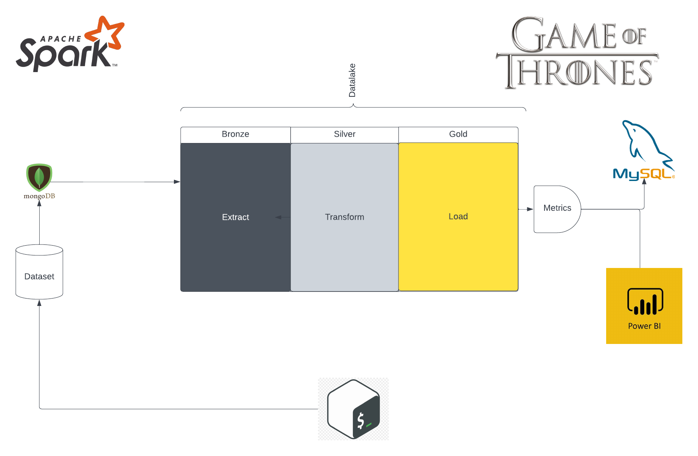
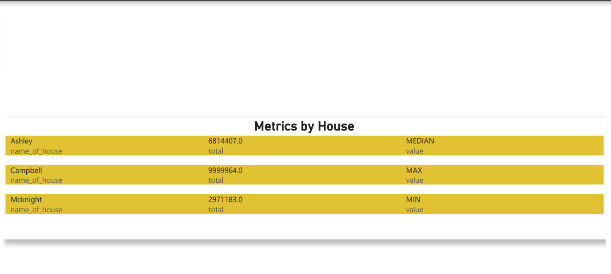
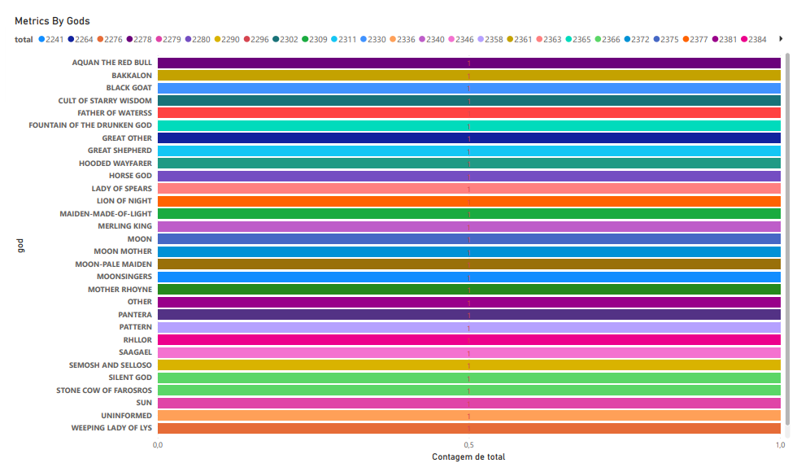
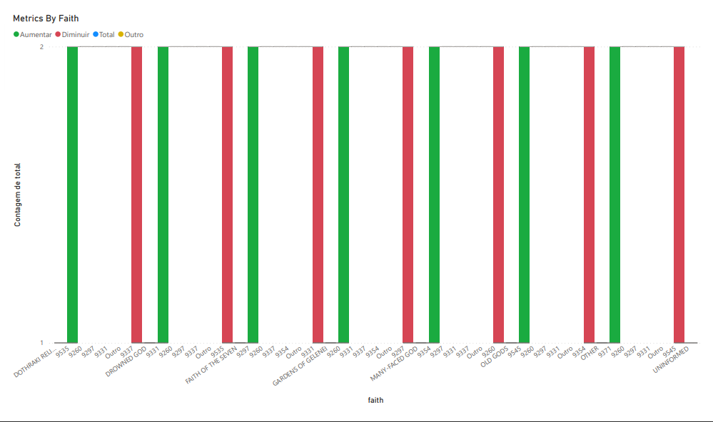

<h1 align="center">


<h3> <p align="center">ETL WITH SPARK SIMULATION OF IRON BANK OF BRAAVOS </p> </h3>
<h3> <p align="center"> ================= </p> </h3>

>> <h3> Solution Architecture </h3>




>> <h3> Glossary of Data </h3>

Glossary
-----------------

Fields	                                                  | Type  	  |    Description                              |
----------------------------------------------------------|:---------:|:-------------------------------------------:|
first_name                  							  |string 	  | name of client                              |
itin													  |string     | The ITIN number is a tax processing number  |
family													  |string     | name of the family to which it belongs      |
house													  |string     | name of the house to which it belongs       |
words													  |string     | motto to live by                            |
title													  |string     | title to refer                              |
gender													  |string     | gender                                      |
date_birth												  |string     | date of birth                               |
faith													  |string     | dominant religion                           |
god_to_pray												  |string     | God who reveres                             |
postalcode												  |string     | postalcode                                  |
street													  |string     | street name informed                        |
number													  |string     | number of street name informed              |
birth_culture   										  |string     | culture that which was baptized             |
country_of_birth										  |string     | country of birth                            |
city_of_birth											  |string     | city of birth                               |
current_culture											  |string     | recently chosen culture                     |
currency_city											  |string     | recently city                               |
rent_income_value										  |string     | amount you got from the bank                |
description_chosen_income_method	    				  |string     | negative or positive value of your income   |
total_account_value										  |string     | total amount your account can reach         |
current_account_total_value								  |string     | amount your account is currently            |
total_amount_carried_over								  |string     | total amount carried over                   |
bank													  |string     | name of the Bank                            |
account_type											  |string     | type of account bank                        |
investor_profile										  |string     | investor profile analysis                   |
account_status											  |string     | status of account                           |
bban_count												  |string     | basic bank account number                   |
aba														  |string     | bank identification code                    |
total_limit_value										  |string     | total value limit                           |
limit_value_available									  |string     | limit value available for use               |
total_limit_used										  |string     | limit value used                            |
description_card										  |string     | type of card                                |
security_card											  |string     | security code of card                       |
expire_card_numbe										  |string     | card expiration date                        |
status_account_blocked									  |string     | Card Lock Status                            |
transaction_code										  |string     | Number entered in card transaction          |
date_transaction										  |string     | date of transaction card                    |
time_transaction										  |string     | time of transaction card                    |
describle_transaction									  |string     | purchased product or service                |
original_transaction_amount								  |string     | value of the purchased product              |
number_installments_assign								  |string     | number installments assign	                |
current_installment										  |string     | current installment          			    |
currency												  |string     | currency used in transaction	            |
yearmonthday											  |string     | date of transaction carried out	            |


>> <h3> Description </h3>

<p> BRAAVOS IRON BANK is the only bank belonging to the great world of A Song of Fire and Ice. In this project, we simulate the advance of this fictional society without natural elements of its world. There is information that characterizes them as Chronicles, such as WESTEROS, WINTERFELL, ESSOS. Its inhabitants have common characteristics. They all have an ITIN, and they have their house mottos as social orientation, but what they have most in common is that they all use BANK FERRO BRAAVOS.
Here you can find all your transactions, products or services purchased, financial, investor profile, etc.
The project is composed of a physical folder>datalake <b>, where our data is called salvadosb</b> in <b> parquet data and a folder <b>files </b>, a data folder <b>files </b>, a folder, where files <b> </b> > </b>are conditioned to be studiedb </b> files by the curious, a folderb>scripts </b> </b> containing <b >python for executing queries and a <b>dataset </b> > folder that composes a mass set of data to feed the databases.
The project starts by running the shell <b>run.sh </b>, it will start the project. The file will create a mass dataset that will store in the <b>dataset</b> folder and after that, run the python files which will actually spark.
The project consists of three layers of datalake.
BRONZE -> Location where the files extracted from the NOSQL database are inserted
SILVER -> Location where the first data deduplication treatment is performed.
GOLD -> Place where the final data storage is placed, with all its normalized form.
After its allocation in datatake GOLD, our data is stored for use in a SQL database (here me or MYSQL, but you can change your favorite database) connected and connected to a POWER BI with insights ready for analysis.
Use some measurements (but are open to more suggestions) such as which houses are most reliable, which religions are most frequent and which are the most frequent.
The project follows the functional organization chart of any contemporary digital bank. It can be adapted for platforms, or run locally, which in this case is in clouds.
Hope you like!
Enjoy the project.</p>

>> <h3> Sample of Data </h3>

```
> db.clients.findOne()
{
        "_id" : ObjectId("624cfafed0d39bed8d8a0c3f"),
        "id" : 5,
        "clients_informations" : {
                "client" : {
                        "id_client" : "PYHI78537115717056",
                        "itin" : "776-64-7654",
                        "name" : "Joshua Rich",
                        "family" : "Rich",
                        "house" : "Rich",
                        "words" : "Off young cost nothing form.",
                        "title" : "Mr. Joshua of house Rich",
                        "gender" : "Male",
                        "date_birth" : "1982-05-09",
                        "faith" : "DROWNED GOD",
                        "god_to_pray" : "SILENT GOD"
                },
                "address" : {
                        "postalcode" : "09475",
                        "street" : "Wilson Glens",
                        "number" : "4039",
                        "birth_culture" : "Unknown",
                        "current_culture" : "First Men",
                        "country_of_birth" : "Sothoryos",
                        "birth_region" : "Basilisk Point",
                        "city_of_birth" : "Ebonhead",
                        "currency_city" : "Asabhad"
                }
        },
        "account_informations" : {
                "account" : {
                        "bank" : "Braavos",
                        "account_type" : "checking account",
                        "investor_profile" : "Vicious",
                        "account_status" : "activated",
                        "bban_count" : "TMLM31027941859033",
                        "aba" : "036306274"
                },
                "accountcard" : {
                        "status_account_blocked" : "activated",
                        "card_number" : "4948956620408444938",
                        "transaction_code" : "KUGQ15480500449027",
                        "date_transaction" : "2022-04-26",
                        "time_transaction" : "14:40:41",
                        "describle_transaction" : "Iron Island Men's Fleet",
                        "original_transaction_amount" : "399545.0",
                        "number_installments_assign" : "4",
                        "current_installment" : "3",
                        "currency" : "SZL of Braavos"
                },
                "card" : {
                        "card_number" : "activated",
                        "total_limit_value" : "159992.0",
                        "limit_value_available" : "89846.0",
                        "total_limit_used" : "70146.0",
                        "description_card" : "JCB 15 digit",
                        "security_card" : "607",
                        "expire_card_number" : "12/28"
                },
                "rent" : {
                        "rent_income_value" : "-126175.0",
                        "description_chosen_income_method" : "-950964.0",
                        "total_account_value" : "2877462.0",
                        "current_account_total_value" : "2742575.0",
                        "total_amount_carried_over" : "134887.0"
                }
        },
        "yearmonthday" : "20220407"

```

>> <h3> metrics by house </h3>



>> <h3> metrics by gods </h3>



>> <h3> metrics by faith </h3>

